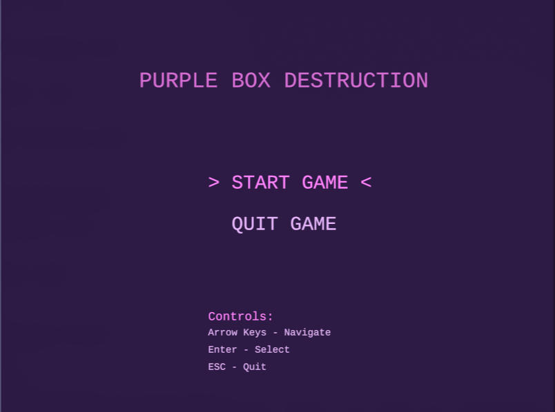
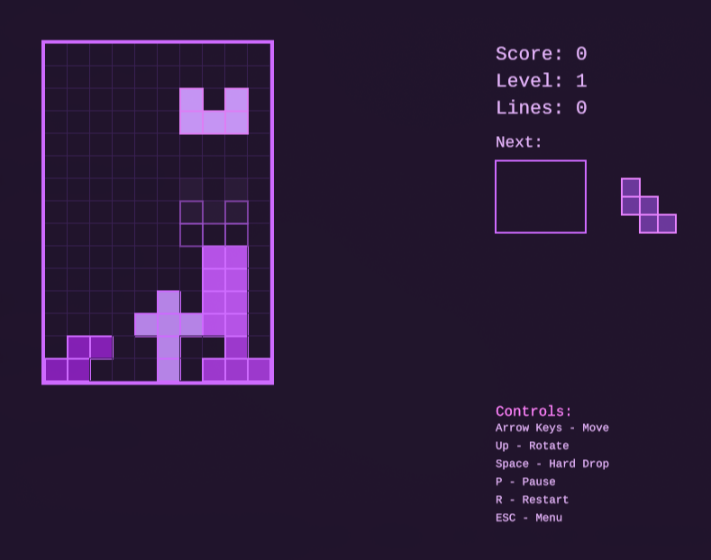

# Purple Box Destruction

<div align="center">

A purple box destruction game implemented in Rust using the ggez library for graphical rendering.



</div>
## Features

- **Box destruction gameplay** featuring classic pieces
- **Modern graphical interface** with vibrant colors and visual effects  
- **Progressive scoring system** based on the number of cleared lines  
- **Automatic difficulty increase** as the level rises  
- **Intuitive controls** with keyboard support  
- **Ghost piece** for better placement visualization  
- **Pause and restart system**  
- **Modular codebase** following Rust best practices  

## Controls

- **Left/Right Arrows**: Move piece horizontally  
- **Down Arrow**: Move piece downward  
- **Up Arrow**: Rotate piece  
- **Spacebar**: Hard drop (instant fall)  
- **P**: Pause/Unpause game  
- **R**: Restart game  
- **ESC**: Exit game  

## Scoring System

- **1 line**: 100 points × level  
- **2 lines**: 300 points × level  
- **3 lines**: 500 points × level  
- **4 lines (Destruction)**: 800 points × level  
- **Hard drop**: 2 points per dropped line  

## Levels

<div align="center">

The level increases every 10 cleared lines. Drop speed increases with level, making the game more challenging.



</div>
## Installation

### Prerequisites

- Rust (version 1.70 or higher)  
- Cargo  


### Build and Run

1. Clone the repository:
```bash
git clone https://github.com/guicybercode/blockdestroy/tree/main
cd purple-box-destruction
```

2. Build and run the game:
```bash
cargo run --release
```

### Build for Distribution

```bash
cargo build --release
```

build in `target/release/purple-box-destruction`.

## Project structure

```
src/
├── main.rs          # Ponto de entrada e loop principal
├── game.rs          # Lógica principal do jogo
├── tetromino.rs     # Definição das peças e suas rotações
├── board.rs         # Gerenciamento do tabuleiro e colisões
├── ui.rs           # Interface do usuário e elementos visuais
└── audio.rs        # Sistema de áudio (placeholder)
```

## TECHNOLOGIES USED

- **Rust**: Main Language
- **ggez**: 2D Gaming
- **rand**: Random Numbers
- **serde**: Future hihihi

## License

This project is licensed under the MIT License. See the LICENSE file for more details.

## :D

하나님의 축복이 있기를 바랍니다 🙏 (God bless you)

